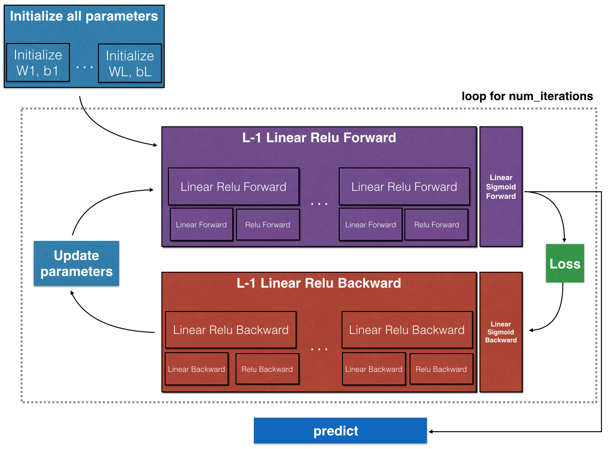
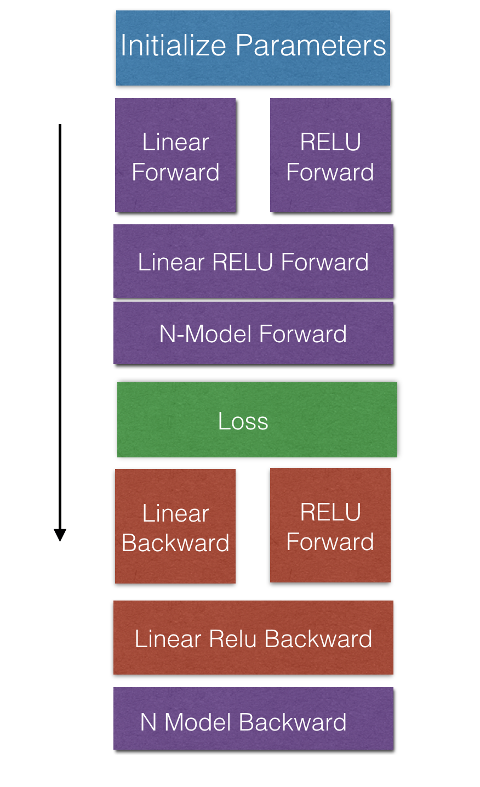
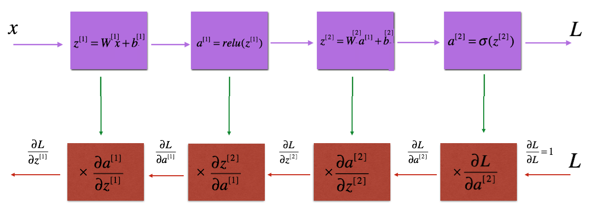
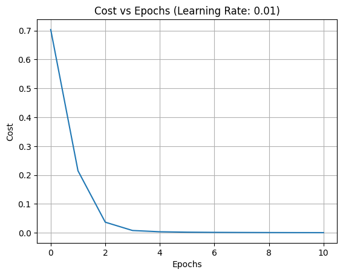
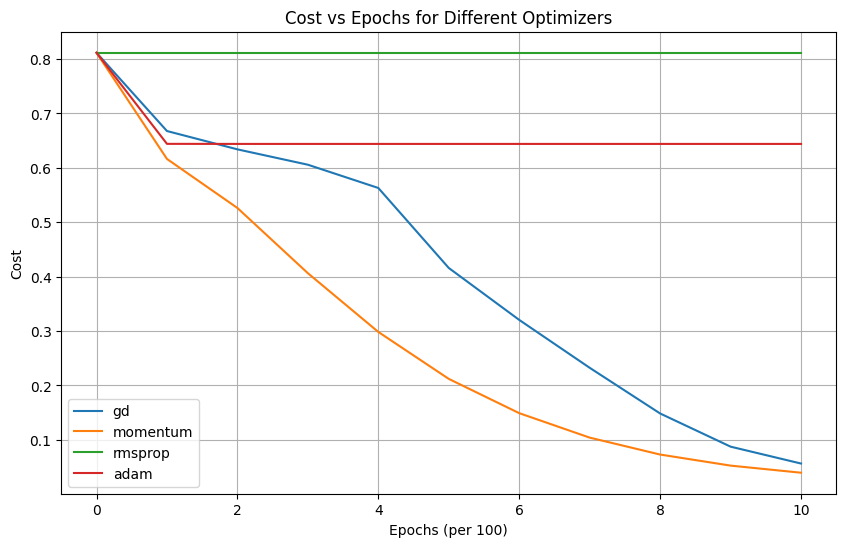
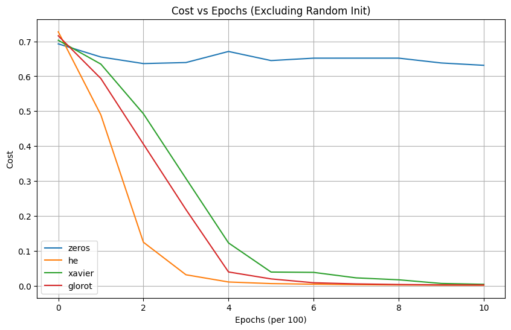
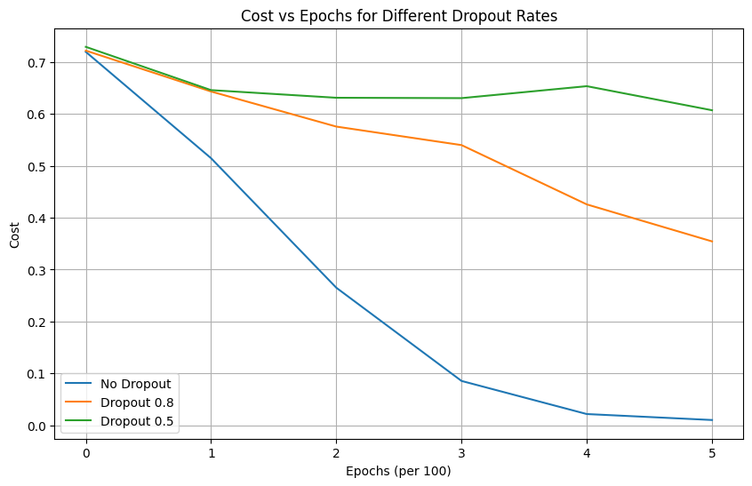
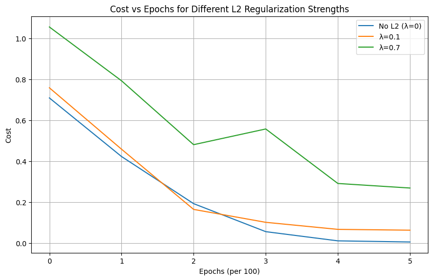
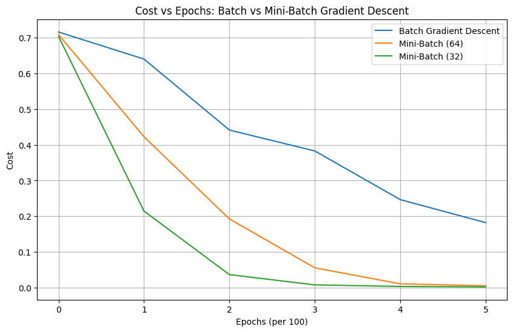
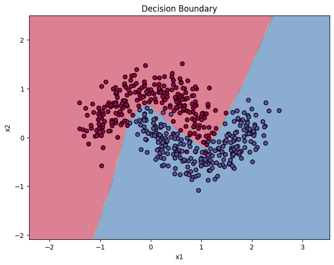

# 🧠 Deep Neural Network from Scratch  

> Built entirely using NumPy — No frameworks. 100% custom implementation.

---

## Introduction



This repository showcases a fully functional deep neural network **built entirely from scratch** using **NumPy**. Every component - forward/backward propagation, weight updates, activations, regularization, and optimization - is manually implemented. No high-level ML/DL libraries (like TensorFlow or PyTorch) are used.  

> This project serves as a demonstration of my deep theoretical knowledge of deep learning and strong NumPy/Python coding abilities.

---

## ✅ Features

- **Architecture:**
  - Modular, multi-layer feedforward neural network
  - Forward and Backward propagation from scratch  
  - Dense (fully connected) layers

- **Core Modules:**
  - Activations: `Sigmoid`, `ReLU`
  - Losses: `Binary Cross-Entropy`
  - Optimizers: `GD`, `Momentum`, `RMSprop`, `Adam`
  - Initializations: `Random`, `Xavier (Glorot)`, `He`, `zero`

- **Training Dynamics:**
  - Mini-batch gradient descent
  - Dropout regularization
  - L2 weight regularization

- **Visualization & Debugging Tools:**
  - Training loss curves, decision boundaries
  - Optimizer/initialization/regularization comparisons
  - Detailed architecture diagrams

---

## Why From Scratch?

> *"If you really want to understand deep learning, implement it yourself."*

Most deep learning engineers rely on high-level libraries. But building it all from scratch:
- Forces you to master the **underlying math** (linear algebra, calculus)
- Makes backpropagation **intuitive**, not magical
- Prepares you to debug and optimize real models
- Proves you understand every part of how deep networks work

This project represents that journey — from pure math to working code.

---

## 🧩 Project Structure

<pre>

deep-nn-from-scratch/
│
├── datasets/                   # Training/testing datasets
│   ├── train_catvnoncat.h5
│   └── test_catvnoncat.h5
│
├── images/                     # Visualizations and architecture diagrams
│   ├── backprop.png
│   ├── batch_minibatches_comp.png
│   ├── cost-vs-epoch-cat-data.png
│   ├── dropout_comp.png
│   ├── inits_comparision.png
│   ├── l2_comp.png
│   ├── learn_rates_comp.png
│   ├── linearback.png
│   ├── mood_data_dec_boundary.png
│   ├── moon_data_cost_epochs.png
│   ├── my_nn.png
│   ├── optimizers_comp.png
│   └── structure.png
│
├── model/                      # Core deep learning components
│   ├── forward_propagation.py
│   ├── backward_propagation.py
│   ├── initialization.py
│   ├── update.py
│   ├── utils.py
│   └── predict.py
│
├── demo_notebook.ipynb         # End-to-end training and visualization demo
├── DNN_Math_And_Theory.ipynb   # Theory + derivations for NN math
├── train.py                    # Script to run training pipeline
└── README.md                   # This file

</pre>


---

## 📘 Theoretical Notebook: `DNN_Math_And_Theory.ipynb`

This notebook derives the math behind neural networks from scratch:
- Matrix calculus for gradients
- Backpropagation derivation
- Layer-wise forward/backward pass
- Activation derivatives
- Cost function intuition

> 🧠 Use this to understand **why** each line of code exists, not just what it does.

---

## 📸 Visual Results & Comparisons

This section showcases the **performance, behavior, and internal workings** of the neural network across various techniques and experiments.

---

### Architecture & Gradient Flow
- **Model Structure Overview**
- Visual explanation of forward/backward propagation paths.




---

### Training Dynamics
                                                                                                                                                                                                  
#### 📈 Cost vs Epochs
- Loss curve during training on the cat vs. non-cat dataset.



#### 🚀 Learning Rate Impact
- Comparing performance across different learning rates.


---

### 🔄 Optimizer Comparison
- Effectiveness of different optimizers: **GD**, **Momentum**, **RMSProp**, **Adam**.



---

### 🎯 Weight Initialization Methods
- Comparison between **Random**, **He**, and **Xavier/Glorot** initializations.



---

### 🛡️ Regularization Techniques

#### Dropout Regularization
- Prevents overfitting by randomly disabling neurons during training.



#### L2 Regularization
- Penalizes large weights to improve generalization.



---

### 🧩 Batch Strategies

#### Batch vs Mini-Batch
- Efficiency and convergence comparison between training with full batch and mini-batches.



---

### 🌙 Decision Boundaries

- Real-time visualizations of learned decision boundaries on synthetic data (e.g., moons).



---


Each image reflects a real experiment run with this framework. These visuals make the network’s internal learning process **transparent** and interpretable.

---

## 💻 Getting Started

### 1. Clone this repository:
```bash
git clone https://github.com/nabeelshan78/deep-nn-from-scratch.git
cd deep-nn-from-scratch
```

## 👨‍💻 Author

**Nabeel Shan**  
📚 Software Engineering Student - NUST Islamabad  
🔬 Aspiring AI Researcher | AI/ML Enthusiast  
🌐 [LinkedIn](https://www.linkedin.com/in/nabeelshan) • [GitHub](https://github.com/nabeelshan78)

---

## ⭐️ Star This Repo

If you found this helpful or interesting, feel free to **star this repo** and follow my journey as I implement more ML and DL algorithms from scratch.

---

## 📬 Feedback

I’m always looking to improve! Feel free to open an issue or send me feedback on how I can improve this repo or its documentation.

